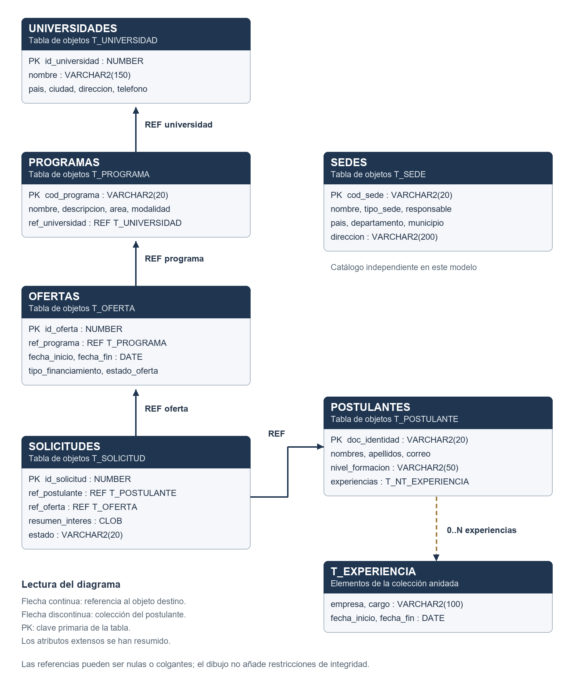

# Sistema de Becas de Posgrado
## Documentación técnica: diseño objeto-relacional y cinco transacciones PL/SQL

**Asignatura:** Base de Datos III  
**Integrante 1:** Jhoel Mollo  
**Integrante 2:** Nava Hugo  
**Docente:** Ing. Ramallo  
**Fecha:** 25 de septiembre de 2026  
**Repositorio:** https://github.com/S0laReX/SistemaBecasPosgrado

> Documento basado en el código existente. Completar las evidencias reales de colaboración. Los ejemplos de estructura son explicativos: no ejecutarlos sobre tablas existentes.

## Contenido

1. Objetivos y cumplimiento del enunciado.
2. Arquitectura del sistema.
3. Diseño DBOO y diccionario de datos.
4. Transacciones, ACID y concurrencia.
5. Instalación: explicación de las sentencias.
6. Explicación detallada de T1–T5.
7. Bloques ejecutables y comandos de SQL Developer.
8. Pruebas y resultados.
9. Integración con C# y MVC.
10. Interfaz académica y catálogos.
11. Instalación y consultas de verificación.
12. Trabajo colaborativo.
13. Limitaciones y mejoras.
14. Preguntas para la defensa.
15. Referencias y anexos de código.

## 1. Objetivos y cumplimiento del enunciado

La tarea pide cinco transacciones ejecutables en PL/SQL sobre la base del proyecto anterior, permite triggers o procedimientos almacenados y exige grupos de dos estudiantes. La solución reutiliza los objetos existentes y permite registrar candidatos, añadir experiencia, postular, resolver solicitudes y cerrar ofertas.

Un procedimiento representa una operación; la transacción queda delimitada por el llamador que confirma o revierte. Tener cinco procedimientos no significa, por sí solo, tener cinco transacciones independientes. Por ello se entregan también cinco bloques anónimos, cada uno con COMMIT y manejo de error con ROLLBACK.

| Requisito | Evidencia |
|---|---|
| Base del proyecto anterior | Tipos y tablas objeto del export histórico |
| Cinco operaciones PL/SQL | Database/01_transacciones.sql: PKG_BECAS |
| Cinco transacciones ejecutables | Database/03_cinco_transacciones.sql |
| Pruebas positivas y negativas | Database/02_pruebas.sql |
| Interfaz funcional | Panel /Transacciones |
| Trabajo entre dos estudiantes | Ramas, commits y PR revisados que deben realizar los integrantes |

No se añadió un trigger: es opcional en el enunciado. Se eligieron procedimientos para invocar explícitamente las reglas desde SQL Developer y desde la web. Una función que solo cuenta aceptados no sustituye ninguna de las cinco tareas de escritura.

## 2. Arquitectura del sistema

```text
Usuario → Vista Razor → TransaccionesController
        → Validación del modelo → TransaccionRepository
        → Transacción ODP.NET → PKG_BECAS → Objetos Oracle
        → COMMIT o ROLLBACK → Mensaje al usuario
```

| Tecnología | Función |
|---|---|
| Oracle Database XE | Almacenamiento, ejecución de SQL/PLSQL y control transaccional |
| SQL Developer | Cliente para inspeccionar objetos y ejecutar scripts |
| PL/SQL | Variables, condiciones, escritura y manejo de excepciones en Oracle |
| ASP.NET Core MVC / .NET 10 | Peticiones HTTP, controladores y vistas |
| Oracle.ManagedDataAccess.Core | Proveedor ODP.NET para llamar Oracle desde C# |
| Razor | Generación de HTML usando el modelo |
| Bootstrap y CSS | Presentación y adaptación de pantallas |
| Git / GitHub | Versionado y revisión colaborativa |

SQL Developer no es la base de datos: es el cliente. La conexión original usa `localhost:1521`, servicio `XE`, esquema `SYSTEM`. El esquema identifica los objetos de un usuario y el servicio identifica el destino de conexión. Ninguno es el nombre de la solución web. ODP.NET admite ejecutar procedimientos almacenados mediante OracleCommand. [Documentación de OracleCommand](https://docs.oracle.com/en/database/oracle/oracle-database/26/odpnt/featOraCommand.html).

## 3. Diseño DBOO y modelo objeto-relacional

### 3.1 Clasificación

La implementación es **objeto-relacional de Oracle**: combina SQL, tablas y claves con tipos de objeto, referencias REF y colecciones. Es correcto explicar su orientación a objetos, pero no presentarla como una base puramente orientada a objetos. [Oracle Objects](https://docs.oracle.com/en/database/oracle/oracle-database/21/adobj/about-oracle-objects.html).

### 3.2 Tipo, objeto y tabla

Un tipo describe atributos. Una instancia contiene valores. Una tabla objeto almacena instancias persistentes de ese tipo. T_POSTULANTE es la estructura; POSTULANTES contiene personas.

```sql
-- Esquema explicativo abreviado; no es un instalador.
CREATE TYPE t_experiencia AS OBJECT (
  empresa VARCHAR2(100), cargo VARCHAR2(100),
  fecha_inicio DATE, fecha_fin DATE
);
/
CREATE TYPE t_nt_experiencia AS TABLE OF t_experiencia;
/
CREATE TYPE t_postulante AS OBJECT (
  doc_identidad VARCHAR2(20), nombres VARCHAR2(100),
  apellidos VARCHAR2(100), correo VARCHAR2(100),
  nivel_formacion VARCHAR2(50), experiencias t_nt_experiencia
);
/
CREATE TABLE postulantes OF t_postulante
  (PRIMARY KEY (doc_identidad))
  NESTED TABLE experiencias STORE AS nt_experiencias_tab;
```

- `AS OBJECT`: define un tipo con atributos.
- `AS TABLE OF`: define un tipo colección; no crea una tabla persistente independiente.
- `CREATE TABLE ... OF`: crea una tabla de objetos.
- `PRIMARY KEY`: identifica registros mediante una clave de negocio.
- `NESTED TABLE ... STORE AS`: configura dónde se almacena la colección.
- `t_postulante(...)`: constructor; sus argumentos siguen el orden de atributos.
- `t_nt_experiencia()`: colección inicializada vacía; no es igual a NULL.

### 3.3 Identidad, REF y navegación

Las tablas objeto poseen identidad de objeto (OID). La clave primaria y la identidad de objeto son conceptos diferentes; no deben declararse equivalentes sin comprobar cómo se configuró el OID.

`REF t_postulante` es una referencia tipada a un objeto postulante. `SELECT REF(p)` obtiene esa referencia. `s.ref_postulante.doc_identidad` navega desde la solicitud hasta el documento referenciado. No es una copia de los atributos ni simplemente un entero que actúa como clave foránea tradicional.

La colección EXPERIENCIAS representa composición: una persona tiene cero o varias experiencias. `TABLE(...)` expone sus elementos como filas para consultar o escribir. El almacenamiento original se llama NT_EXPERIENCIAS_TAB. No es un campo JSON ni una cadena de valores separados por comas. [Colecciones Oracle](https://docs.oracle.com/en/database/oracle/oracle-database/21/adobj/collection-data-types.html).

| Concepto de objetos | Presencia real |
|---|---|
| Tipos y objetos persistentes | Sí |
| Composición mediante colección | Sí: experiencias del postulante |
| Asociaciones por REF | Sí |
| Agrupación de reglas | PKG_BECAS, como paquete separado |
| Métodos MEMBER o STATIC en los tipos | No se implementaron |
| Herencia con UNDER | No se utiliza |
| Polimorfismo | No se implementó una jerarquía polimórfica |

Un paquete no es una clase de dominio ni convierte sus procedimientos en métodos del objeto. La agrupación de reglas tampoco impide que un usuario con permisos escriba directamente en las tablas.

### 3.4 Diccionario de datos

#### T_POSTULANTE / POSTULANTES

| Atributo | Tipo | Significado |
|---|---|---|
| doc_identidad | VARCHAR2(20) | Documento y clave primaria |
| nombres | VARCHAR2(100) | Nombres |
| apellidos | VARCHAR2(100) | Apellidos |
| correo | VARCHAR2(100) | Correo electrónico |
| nivel_formacion | VARCHAR2(50) | Nivel académico |
| experiencias | T_NT_EXPERIENCIA | Colección laboral |

#### T_EXPERIENCIA / T_NT_EXPERIENCIA

| Atributo | Tipo | Significado |
|---|---|---|
| empresa | VARCHAR2(100) | Organización |
| cargo | VARCHAR2(100) | Puesto |
| fecha_inicio | DATE | Inicio |
| fecha_fin | DATE | Fin; NULL permite empleo sin cierre informado |

No hay identificador individual ni regla de duplicidad de experiencias en el paquete.

#### T_SOLICITUD / SOLICITUDES

| Atributo | Tipo | Significado |
|---|---|---|
| id_solicitud | NUMBER | Clave primaria generada con secuencia en el paquete |
| ref_postulante | REF T_POSTULANTE | Solicitante |
| ref_oferta | REF T_OFERTA | Oferta elegida |
| resumen_interes | CLOB | Motivación |
| estado | VARCHAR2(20) | Pendiente, Aceptada o Rechazada en el flujo nuevo |

La columna CLOB admite más texto que el máximo de 2000 caracteres impuesto por esta operación. El límite pertenece al formulario y al procedimiento, no a la capacidad máxima de CLOB.

#### T_OFERTA / OFERTAS

| Atributo | Tipo | Significado |
|---|---|---|
| id_oferta | NUMBER | Identificador |
| ref_programa | REF T_PROGRAMA | Programa |
| fecha_inicio / fecha_fin | DATE / DATE | Periodo de recepción |
| tipo_financiamiento | VARCHAR2(100) | Financiamiento |
| estado_oferta | VARCHAR2(20) | Vigente o Cerrada en el flujo |

No existe un atributo de cupo máximo de becas. Aceptar solicitudes no descuenta capacidad; contar aceptados únicamente obtiene una cantidad.

#### Catálogos complementarios

| Tipo / tabla | Atributos |
|---|---|
| T_PROGRAMA / PROGRAMAS | cod_programa VARCHAR2(20), nombre VARCHAR2(150), descripcion VARCHAR2(500), area VARCHAR2(100), tipo_programa VARCHAR2(50), modalidad VARCHAR2(50), ref_universidad REF T_UNIVERSIDAD |
| T_UNIVERSIDAD / UNIVERSIDADES | id_universidad NUMBER, nombre VARCHAR2(150), pais VARCHAR2(50), ciudad VARCHAR2(50), direccion VARCHAR2(200), telefono VARCHAR2(20) |
| T_SEDE / SEDES | cod_sede VARCHAR2(20), nombre VARCHAR2(150), tipo_sede VARCHAR2(50), responsable VARCHAR2(100), pais VARCHAR2(50), departamento VARCHAR2(50), municipio VARCHAR2(50), direccion VARCHAR2(200) |

### 3.5 Relaciones



```text
UNIVERSIDADES ← REF — PROGRAMAS ← REF — OFERTAS ← REF — SOLICITUDES
                                                           |
                                                          REF
                                                           ↓
                                                      POSTULANTES
                                                           |
                                                   colección anidada
                                                           ↓
                                                   T_EXPERIENCIA [0..N]

SEDES: catálogo independiente en este modelo.
```

Una universidad puede tener varios programas; un programa, varias ofertas; una oferta, varias solicitudes; una persona, varias solicitudes y experiencias. El límite de tres solicitudes se impone en el procedimiento, sobre el historial total.

T_OFERTA no contiene ref_sede ni id_sede. Algunas funciones antiguas del export mencionan otra estructura: no se deben usar para inventar una relación ausente en los tipos utilizados.

En el export inspeccionado no se encontraron declaraciones SCOPE FOR ni restricciones referenciales sobre los REF. No se debe afirmar obligatoriedad o integridad completa solo por el diagrama. Puede haber referencias nulas o colgantes tras borrar objetos destino. El paquete verifica existencia al postular, pero no protege todos los borrados de los CRUD anteriores.

## 4. Transacciones, ACID y concurrencia

Una transacción agrupa operaciones confirmadas o revertidas como unidad. `BEGIN ... END` delimita un bloque PL/SQL, no una transacción completa por sí solo. El llamador establece los límites mediante COMMIT/ROLLBACK. [Control transaccional Oracle](https://docs.oracle.com/en/database/oracle/oracle-database/21/lnpls/static-sql.html).

| Propiedad | Aplicación |
|---|---|
| Atomicidad | Se revierte el trabajo no confirmado cuando falla |
| Consistencia | Se respetan las restricciones y reglas que sí existen |
| Aislamiento | Bloqueos coordinan las escrituras concurrentes |
| Durabilidad | El cambio confirmado persiste conforme a las garantías de Oracle |

COMMIT confirma toda la transacción de la sesión, no solo la última sentencia. ROLLBACK revierte cambios pendientes; no deshace commits anteriores. SAVEPOINT marca un punto intermedio; ROLLBACK TO vuelve a él. Los cinco bloques del guion son independientes: si T4 falla, T1–T3 ya confirmadas permanecen. [Transacciones](https://docs.oracle.com/en/database/oracle/oracle-database/21/cncpt/transactions.html).

Los procedimientos no hacen COMMIT interno: la web confirma una operación por petición y las pruebas agrupan varias en una sola transacción. Lanzar una excepción no debe confundirse con revertir toda la transacción; por eso el llamador incluye ROLLBACK explícito.

`FOR UPDATE WAIT 5` bloquea las filas seleccionadas y espera hasta cinco segundos si existe un bloqueo incompatible. No limita a cinco segundos toda la operación. Los bloqueos se liberan al finalizar la transacción, no al salir simplemente del procedimiento.

T3 bloquea candidato y luego oferta. Dos postulaciones de la misma persona se serializan antes del conteo. T5 bloquea la oferta para coordinarse con la recepción de solicitudes. T4 bloquea la solicitud para impedir resoluciones simultáneas contradictorias. Estas garantías exigen que las escrituras sigan el mismo protocolo; los métodos heredados pueden omitirlo. No se ejecutó una prueba automática con dos sesiones concurrentes: se documenta el diseño, no un ensayo inexistente.

## 5. Instalación: explicación de las sentencias

Archivo: Database/01_transacciones.sql. Añade el paquete y crea la secuencia si falta; no reconstruye la base anterior.

| Sentencia | Función |
|---|---|
| `-- comentario` | Texto explicativo no ejecutado |
| `SET SERVEROUTPUT ON` | Orden del cliente para mostrar DBMS_OUTPUT; no es PL/SQL |
| `WHENEVER SQLERROR EXIT SQL.SQLCODE ROLLBACK` | Política del ejecutor ante error SQL: salir con código y revertir trabajo pendiente; no necesariamente cubre errores propios del cliente |
| `DECLARE` | Inicia declaraciones de un bloque anónimo |
| `n NUMBER; existe NUMBER;` | Variables numéricas locales |
| `BEGIN` / `END;` | Delimitan instrucciones |
| `SELECT COUNT(*) INTO existe FROM user_sequences ...` | Cuenta secuencias con ese nombre en el esquema y asigna el resultado |
| `IF existe=0 THEN` | Crea solo cuando no existe |
| `MAX(id_solicitud)` | Mayor identificador almacenado |
| `NVL(...,0)+1` | Usa cero si no hay registros y obtiene el siguiente inicio |
| `EXECUTE IMMEDIATE` | Ejecuta DDL construido dinámicamente |
| `||` | Concatena texto |
| `TO_CHAR(n,'TM9')` | Convierte el número a representación textual compacta |
| `CREATE SEQUENCE ... START WITH` | Crea el generador de valores |
| `/` en línea separada | Solicita al cliente ejecutar el bloque completo |
| `CREATE OR REPLACE PACKAGE ... AS` | Define o reemplaza la interfaz pública |
| `PROCEDURE nombre(...)` | Declara una operación sin valor RETURN; parámetros IN por defecto |
| `CREATE OR REPLACE PACKAGE BODY ... AS` | Define las implementaciones |
| `IS` | Separa cabecera del procedimiento y declaraciones |
| `SHOW ERRORS PACKAGE BODY` | Muestra diagnósticos de compilación desde el cliente |
| `user_errors` | Vista del diccionario con diagnósticos de los objetos del esquema |
| `RAISE_APPLICATION_ERROR(-20090,...)` | Hace fallar la validación final cuando encuentra diagnósticos |

Usar MAX+1 en cada inserción sería inseguro ante dos sesiones que leen el mismo máximo. El paquete usa NEXTVAL; MAX solo calcula el inicio durante instalación con las escrituras detenidas. Si la secuencia ya existe no se reajusta automáticamente: una importación posterior de claves mayores exige revisión administrativa.

El DDL produce confirmaciones implícitas: instalar en una sesión sin trabajo pendiente. El bloque final cuenta USER_ERRORS sin filtrar ATTRIBUTE; si se activan advertencias de compilación y aparecen allí, podrían hacer fallar esa comprobación también.

## 6. Explicación de las cinco operaciones

### 6.1 T1: registrar candidato

**Firma:** `registrar_candidato(p_doc, p_nombres, p_apellidos, p_correo, p_nivel)`.

1. TRIM elimina espacios de los extremos de los campos comprobados.
2. IS NULL detecta datos ausentes. Oracle trata la cadena vacía como NULL.
3. OR combina causas de rechazo: basta una verdadera.
4. REGEXP_LIKE comprueba un formato básico de correo.
5. RAISE_APPLICATION_ERROR(-20001,...) interrumpe por datos inválidos.
6. INSERT INTO postulantes VALUES(...) inserta el objeto construido por t_postulante.
7. t_nt_experiencia() inicializa su colección vacía.
8. EXCEPTION WHEN DUP_VAL_ON_INDEX traduce un duplicado de unicidad a -20002.

La expresión `^[^ @]+@[^ @]+\.[^ @]+$` exige texto antes de @, texto después y un punto en el dominio. `^` y `$` anclan principio y fin; `[^ @]` excluye espacio y @; `+` permite una o más repeticiones; `\.` representa un punto literal. No comprueba la existencia del correo ni implementa todas las variantes del estándar de correo.

Resultado: candidato creado con colección vacía. No crea solicitud automáticamente. La web valida longitudes; el procedimiento no repite explícitamente todos esos límites, por lo que una llamada directa demasiado larga puede recibir un error nativo de Oracle.

### 6.2 T2: agregar experiencia

**Firma:** `agregar_experiencia(p_doc,p_empresa,p_cargo,p_inicio,p_fin)`.

| Instrucción | Función |
|---|---|
| `TRIM(p_empresa) IS NULL ...` | Rechaza empresa o cargo vacíos |
| `p_inicio IS NULL` | Exige inicio |
| `p_fin < p_inicio` | Rechaza fin anterior al inicio |
| `SELECT doc_identidad INTO v_doc ... FOR UPDATE WAIT 5` | Comprueba existencia y bloquea el candidato |
| `UPDATE ... SET p.experiencias=t_nt_experiencia() ... IS NULL` | Inicializa solamente una colección nula, conservando las existentes |
| `INSERT INTO TABLE(SELECT p.experiencias ...)` | Usa la colección de esa persona como destino |
| `VALUES(t_experiencia(...))` | Construye e inserta empresa, cargo y fechas |
| `WHEN NO_DATA_FOUND` | Traduce candidato inexistente a -20004 |

Un fin NULL no vuelve verdadera la comparación de fechas, de modo que se permite si los demás campos son válidos. Se admiten fechas iguales y no se impide inicio futuro, solapamiento o experiencia duplicada. `v_doc` recibe la comprobación de existencia/bloqueo; no identifica una experiencia.

Inicialización e inserción pertenecen a la misma transacción y se revierten juntas cuando el llamador hace ROLLBACK.

### 6.3 T3: enviar postulación

**Firma:** `postular(p_doc,p_oferta,p_resumen)`.

1. **Motivación:** TRIM(... ) IS NULL rechaza ausencia; LENGTH(... )>2000 rechaza exceso. LENGTH mide caracteres.
2. **Candidato:** SELECT INTO comprueba existencia y FOR UPDATE coordina postulaciones de esa persona.
3. **Oferta:** se leen estado, inicio y fin en variables y se bloquea la fila.
4. **Plazo:** se rechazan estado NULL, estado distinto de Vigente y fechas ausentes. TRUNC(SYSDATE) toma el día del servidor sin hora. NOT BETWEEN rechaza estar fuera del intervalo inclusivo: inicio y fin se admiten completos.
5. **Duplicidad:** COUNT filtra por documento y oferta mediante REF; n>0 devuelve -20007.
6. **Límite:** COUNT filtra por documento; n>=3 devuelve -20008. Cuenta todas las solicitudes históricas, incluso rechazadas y aceptadas. No se limita a pendientes ni a un año académico.
7. **Referencias:** SELECT REF(p) INTO rp y SELECT REF(o) INTO ro obtienen las referencias a los objetos.
8. **Clave:** seq_becas_solicitud.NEXTVAL entrega el identificador; los valores consumidos no se recuperan tras rollback.
9. **Inserción:** t_solicitud(id,rp,ro,p_resumen,'Pendiente') construye la solicitud y el INSERT la almacena.
10. **Ausencia:** NO_DATA_FOUND se transforma en -20009 si falta candidato u oferta.

Los alias p, o y s identifican tablas en cada consulta. rp y ro son variables REF, no claves enteras. El procedimiento recibe VARCHAR2 y almacena el texto en un atributo CLOB, con límite funcional de 2000 caracteres.

La duplicidad se verifica antes que el máximo; si coinciden ambos problemas se informa primero el duplicado. No devuelve un parámetro OUT con la clave: el guion la consulta después por candidato y oferta.

### 6.4 T4: resolver una solicitud

**Firma:** `resolver(p_solicitud,p_estado)`.

`p_estado IS NULL OR p_estado NOT IN ('Aceptada','Rechazada')` rechaza valores de resolución inválidos. El SELECT INTO con FOR UPDATE bloquea y lee el estado. NO_DATA_FOUND se traduce a -20012.

`v_estado IS NULL OR v_estado<>'Pendiente'` exige solicitud pendiente; `<>` significa distinto. El UPDATE cambia únicamente la fila cuya clave coincide con p_solicitud.

Flujos permitidos: Pendiente → Aceptada o Pendiente → Rechazada. No permite volver a Pendiente ni modificar una resolución final. No exige que la oferta esté Vigente: se puede evaluar una pendiente después de cerrar recepción. No evalúa méritos, puntuación, documentos ni presupuesto.

### 6.5 T5: cerrar oferta

**Firma:** `cerrar_oferta(p_oferta)`.

El SELECT con bloqueo obtiene el estado y comprueba existencia. Si es NULL o distinto de Vigente, devuelve -20013. El UPDATE cambia estado_oferta a Cerrada. NO_DATA_FOUND produce -20014.

No borra oferta, no modifica fechas y no rechaza solicitudes automáticamente. Las resoluciones existentes se conservan. Un segundo cierre devuelve error; no es una operación silenciosamente idempotente. No existe reapertura en el paquete.

### 6.6 Catálogo de errores

| Código | Significado |
|---|---|
| -20001 | Datos obligatorios o correo inválidos |
| -20002 | Documento duplicado |
| -20003 | Datos o fechas de experiencia inválidos |
| -20004 | Candidato inexistente al agregar experiencia |
| -20005 | Motivación vacía o demasiado extensa |
| -20006 | Oferta no vigente, sin fechas o fuera del plazo |
| -20007 | Postulación repetida |
| -20008 | Límite de tres alcanzado |
| -20009 | Falta candidato u oferta al postular |
| -20010 | Resolución distinta de Aceptada/Rechazada |
| -20011 | Solicitud que no está pendiente |
| -20012 | Solicitud inexistente |
| -20013 | Oferta que no está vigente al cerrar |
| -20014 | Oferta inexistente al cerrar |
| -20090 | Diagnósticos de compilación detectados |
| -20999 | Aserción de prueba incumplida |

No sustituye todos los errores Oracle posibles. Fallos de bloqueo, conexión, tamaño o tipos pueden producir códigos nativos; la web presenta un mensaje general para ellos.

## 7. Bloques ejecutables y comandos de SQL Developer

Archivo: Database/03_cinco_transacciones.sql. Cada transacción usa este patrón:

```sql
BEGIN
  pkg_becas.resolver(:solicitud,'Aceptada');
  COMMIT;
  DBMS_OUTPUT.PUT_LINE('T4 confirmada: solicitud aceptada.');
EXCEPTION WHEN OTHERS THEN
  ROLLBACK;
  RAISE;
END;
/
```

La llamada escribe, COMMIT confirma y PUT_LINE informa. WHEN OTHERS captura errores no tratados; ROLLBACK revierte pendientes y RAISE propaga el fallo original. Si una instrucción posterior al COMMIT fallara, el rollback ya no podría deshacer lo confirmado.

| Elemento | Explicación |
|---|---|
| SET DEFINE ON | Activa sustitución textual con & |
| ACCEPT documento CHAR PROMPT | Solicita texto al usuario |
| ACCEPT oferta NUMBER PROMPT | Solicita valor numérico |
| &documento / &oferta | Sustitución previa a la ejecución; no es binding |
| VARIABLE solicitud NUMBER | Variable del cliente compartida por los bloques |
| :solicitud | Referencia enlazada a esa variable |
| DATE '2025-01-01' | Literal de fecha independiente de NLS_DATE_FORMAT |
| NULL | Fecha de fin ausente |
| DBMS_OUTPUT.PUT_LINE | Diagnóstico visible en el cliente; no respuesta de negocio de la web |
| SELECT ... INTO :solicitud | Recupera la clave de la solicitud creada |
| UNDEFINE | Elimina variables de sustitución, no registros |

Ejecutar con F5 / Ejecutar script. Introducir documento simple sin comillas y una oferta de demostración. La sustitución textual es apropiada para un guion controlado, no para entradas arbitrarias. La web utiliza parámetros enlazados.

Este archivo confirma cambios persistentes y cierra la oferta elegida. El archivo de pruebas, en cambio, revierte sus datos. No son intercambiables.

## 8. Pruebas y resultados

Archivo: Database/02_pruebas.sql.

SYS_GUID genera un identificador; RAWTOHEX lo convierte a hexadecimal; SUBSTR limita la longitud y el prefijo QA produce un documento de 20 caracteres. Otra porción hexadecimal se convierte con TO_NUMBER(...,'XXXXXXXXXX') y se vuelve negativa para generar ofertas de prueba. Esto reduce colisiones con IDs normales, pero no es una reserva formal de números.

El procedimiento local verificar(ok BOOLEAN,mensaje VARCHAR2) lanza -20999 cuando ok es FALSE o NULL. `:=` asigna y `=` compara. SAVEPOINT inicio_prueba marca el comienzo. La oferta temporal tiene programa NULL para aislar las reglas de postulación: esta prueba no verifica integridad completa de catálogos. SYSDATE-1 y SYSDATE+1 mantienen el plazo abierto.

Cada bloque negativo llama una operación inválida y, si no falla, lanza -20999. El manejador compara SQLCODE con el error esperado y relanza cualquier otro. Así un fallo inesperado no pasa como éxito. FOR i IN 1..3 LOOP repite tres veces la creación de ofertas para probar el límite.

| Caso | Resultado esperado y comprobado |
|---|---|
| Crear candidato | Una fila |
| Repetir candidato | -20002 |
| Agregar experiencia | Un elemento en colección |
| Fin anterior al inicio | -20003 |
| Postular | Solicitud encontrada |
| Duplicar postulación | -20007 |
| Resolver | Estado Aceptada |
| Cambiar resolución final | -20011 |
| Cerrar | Estado Cerrada |
| Postular a cerrada | -20006 |
| Cuarta solicitud | -20008 |
| Rollback | No quedan candidato ni ofertas temporales |

ROLLBACK TO inicio_prueba revierte los datos. Dos consultas verifican ausencia del candidato y ofertas; no hay una aserción separada de ausencia de solicitudes, aunque sus inserciones están en la misma transacción. ROLLBACK final termina el trabajo: usar una sesión sin cambios propios pendientes.

**Observado durante la implementación:** paquete y cuerpo compilaron en Oracle XE; las cinco operaciones, seis rechazos y rollback pasaron. La aplicación compiló sin errores y con 85 advertencias de nulabilidad heredadas. Se probó en navegador el rechazo de candidato inexistente conservando campos y el registro de un candidato temporal; su COMMIT se verificó desde otra sesión y luego se retiró ese registro.

No se afirma cobertura total. Quedan por ampliar: todas las ramas de error, concurrencia con dos sesiones, fallo durante COMMIT, referencias colgantes y los cinco recorridos completos desde el navegador.

## 9. Integración con C# y ASP.NET MVC

### 9.1 Program.cs

WebApplication.CreateBuilder prepara la aplicación. AddJsonFile incorpora appsettings.Local.json de forma opcional y permite recargarlo al cambiar. AddEnvironmentVariables, agregado después, permite que el entorno tenga prioridad. AddControllersWithViews habilita MVC y AddScoped registra el repositorio con duración por petición.

Los registros van a consola/debug para evitar permisos sobre el Event Log de Windows. UseStaticFiles sirve CSS y archivos; UseRouting resuelve rutas. UseAuthorization no crea por sí solo autenticación, cuentas o roles. La ruta predeterminada es Transacciones/Index.

### 9.2 TransaccionViewModel

Required exige operación. StringLength limita longitudes; EmailAddress valida correo en el servidor. Los tipos con `?` permiten valores ausentes. IValidatableObject añade validaciones según el trámite: campos obligatorios, fechas, identificadores positivos y resolución válida.

`yield return new ValidationResult(...)` devuelve cada error al mecanismo de validación MVC. El modelo no sustituye las reglas en Oracle porque existen otros clientes y el navegador puede omitir sus comprobaciones.

PanelBecasViewModel combina formulario, listas de ofertas y solicitudes, y disponibilidad. OpcionBeca contiene un ID y descripción para los selectores.

### 9.3 TransaccionesController

| Elemento | Responsabilidad |
|---|---|
| HttpGet / Index | Selecciona el formulario y carga datos |
| HttpPost / Ejecutar | Recibe una operación de escritura |
| ValidateAntiForgeryToken | Comprueba token antifalsificación; mitiga CSRF, no autentica usuarios |
| Bind(Prefix="Formulario") | Lee los campos enviados con ese prefijo |
| ModelState.IsValid | Impide escribir si falló la validación del modelo |
| repository.Ejecutar | Llama al repositorio de Oracle |
| TempData | Conserva el mensaje durante la redirección |
| RedirectToAction | Aplica POST → redirección → GET para reducir reenvíos al actualizar |
| catch OracleException | Traduce errores previstos; para otros muestra un mensaje general |
| Mostrar(formulario) | Recarga listas y conserva datos ante error |

OracleException.Number se compara como positivo; SQLCODE en PL/SQL entrega negativo para estos errores. La redirección no es una solución completa de idempotencia: aún pueden existir dobles envíos.

### 9.4 TransaccionRepository: consulta

Conexion lee OracleDB y rechaza configuración vacía. `using var` libera recursos al salir del ámbito y Open establece la conexión.

La consulta USER_OBJECTS verifica dos objetos VALID: PACKAGE y PACKAGE BODY. No demuestra que todas las operaciones futuras funcionen o que existan todos los permisos. Los otros SELECT obtienen ofertas Vigentes y solicitudes Pendientes, ordenadas por ID. Los indicadores usan esas listas; el conteo de ofertas no filtra fechas.

ExecuteScalar devuelve la primera celda del COUNT. ExecuteReader devuelve un lector que avanza con Read. GetInt32 obtiene claves de 32 bits, aunque NUMBER de Oracle puede almacenar un rango mayor.

### 9.5 TransaccionRepository: escritura

| Instrucción | Función |
|---|---|
| cn.BeginTransaction() | Inicia control transaccional explícito con ODP.NET |
| cmd.Transaction = tx | Asocia comando y transacción |
| cmd.BindByName = true | Enlaza parámetros por nombre |
| CommandType.StoredProcedure | Interpreta CommandText como procedimiento |
| P(nombre,tipo,valor) | Función local que añade parámetros tipados |
| DBNull.Value | Representa NULL de base de datos |
| switch(m.Operacion) | Selecciona uno de cinco nombres de procedimiento conocidos |
| OracleDbType.Varchar2, Date, Int32 | Tipos enviados al proveedor |
| ExecuteNonQuery() | Ejecuta la operación sin solicitar una tabla de resultados |
| tx.Commit() | Confirma tras éxito |
| catch / tx.Rollback() / throw | Revierte y propaga el fallo |

Los nombres de procedimiento proceden de una lista fija y los valores viajan por parámetros, sin concatenar datos del usuario en SQL. Esto separa datos de instrucciones; no reemplaza validación ni permisos.

### 9.6 Razor

`@model` declara el modelo. `@if` elige los campos del trámite y `@foreach` genera opciones. `asp-for` vincula propiedades, controles y etiquetas. `asp-action` y `asp-controller` generan rutas. El formulario POST mediante Tag Helpers incorpora el token antifalsificación.

`asp-validation-summary="All"` muestra errores. Los atributos required, maxlength y type=email ayudan al navegador; no son la única validación. El fieldset se deshabilita cuando el servicio no está disponible. Razor codifica las expresiones de texto por defecto. `asp-append-version` cambia la URL del CSS con su contenido para ayudar a invalidar caché.

## 10. Funcionalidades y diseño académico

El portal usa azul marino, blanco, detalles dorados y emblema de libro. La identidad Estudios de Posgrado es genérica: no atribuye una universidad concreta sin información del usuario. Se combinan títulos serif con tipografía de interfaz en los controles.

| Sección | Función |
|---|---|
| Gestión de becas | Cinco operaciones del paquete nuevo |
| Postulantes | Catálogo y flujos anteriores de candidatos y experiencia |
| Convocatorias | Listar, crear, editar y eliminar ofertas mediante el módulo heredado |
| Programas | Gestión del catálogo de programas |
| Universidades | Gestión de instituciones |
| Sedes | Gestión del catálogo independiente de sedes |

El panel tiene indicadores, menú lateral de trámites, formulario contextual y ayuda sobre el límite. Los cinco trámites no constituyen obligatoriamente cinco pasos que cada persona deba completar: resolver y cerrar son tareas de gestión.

La interfaz conserva campos ante errores, muestra resultados y distingue campos obligatorios. Usa aria-current para la sección activa, etiquetas, foco visible y enlace para saltar al contenido. El CSS adapta la distribución a pantallas pequeñas. Esto no equivale a una auditoría formal de accesibilidad.

Los CRUD anteriores siguen usando métodos distintos, SQL directo o procedimientos antiguos. Para demostrar las cinco transacciones se utiliza /Transacciones. No se debe afirmar que todas las pantallas utilizan PKG_BECAS.

## 11. Instalación y verificación

### 11.1 Orden de trabajo

1. Abrir SistemaBecasWeb.slnx o el csproj en Visual Studio compatible con .NET 10 y desarrollo ASP.NET.
2. Conectar SQL Developer al esquema con los tipos y tablas anteriores.
3. Detener escrituras durante la primera instalación de la secuencia y ejecutar 01_transacciones.sql con F5.
4. Comprobar compilación y ejecutar 02_pruebas.sql en sesión sin cambios propios pendientes.
5. Configurar la conexión local a partir de appsettings.Local.example.json. No incluir contraseñas en la documentación o capturas.
6. Recompilar y ejecutar. El perfil HTTP de Visual Studio usa localhost:5098; entrar en /Transacciones. Los puertos 5078 y 5082 fueron vistas previas manuales.
7. Preparar documento nuevo y oferta de práctica para 03_cinco_transacciones.sql, que sí confirma cambios.

El export script_becas_full.sql incluye objetos internos de SYSTEM ajenos a la tarea. No es un instalador limpio y no debe reimportarse indiscriminadamente. Los scripts nuevos presuponen que el esquema académico existe.

### 11.2 Consultas de lectura

```sql
-- Identificar esquema.
SELECT USER FROM dual;

-- Estado de especificacion y cuerpo.
SELECT object_name, object_type, status
FROM user_objects WHERE object_name='PKG_BECAS';

-- Diagnosticos de compilacion.
SELECT type, line, position, text
FROM user_errors WHERE name='PKG_BECAS'
ORDER BY type, sequence;

-- Estructura del tipo.
SELECT attr_no, attr_name, attr_type_name, length
FROM user_type_attrs WHERE type_name='T_POSTULANTE'
ORDER BY attr_no;

-- Ofertas y plazo.
SELECT o.id_oferta, o.ref_programa.nombre programa,
       o.estado_oferta, o.fecha_inicio, o.fecha_fin
FROM ofertas o ORDER BY o.id_oferta;

-- Solicitudes: navegacion REF.
SELECT s.id_solicitud, s.ref_postulante.doc_identidad documento,
       s.ref_oferta.id_oferta oferta, s.estado
FROM solicitudes s ORDER BY s.id_solicitud;

-- Experiencias de una persona: proporcionar :documento en el cliente.
SELECT e.empresa, e.cargo, e.fecha_inicio, e.fecha_fin
FROM postulantes p, TABLE(p.experiencias) e
WHERE p.doc_identidad=:documento;

-- Diagnostico de referencias colgantes.
SELECT s.id_solicitud FROM solicitudes s
WHERE s.ref_postulante IS DANGLING OR s.ref_oferta IS DANGLING;
```

Una referencia NULL no es lo mismo que una referencia colgante. Para capturas de entrega, utilizar datos ficticios; los listados pueden contener datos personales de la base anterior.

### 11.3 Fallos frecuentes

| Síntoma | Revisar |
|---|---|
| No aparece el diseño | Abrir la copia local correcta, recompilar y recargar CSS |
| Servicio no disponible | Conexión local, Oracle iniciado y PKG_BECAS válido |
| Oferta visible pero rechazada | El listado filtra estado; T3 comprueba además el plazo |
| Cuarta solicitud rechazada tras una denegación | El máximo cuenta también rechazadas |
| Error al importar todo el export | Contiene objetos SYSTEM; no es un instalador de la aplicación |
| Huecos en IDs | NEXTVAL consumido incluso cuando se revierte |
| Espera o error de bloqueo | Otra sesión puede tener cambios sin confirmar |

## 12. Trabajo colaborativo con GitHub

Repositorio: S0laReX/SistemaBecasPosgrado. Se prepararon workflow de compilación y plantilla de PR. Eso no prueba que dos personas ya hayan contribuido; la entrega debe mostrar aportes y revisiones reales.

| Integrante | Responsabilidad propuesta | Revisión |
|---|---|---|
| 1 | Modelo de objetos, paquete, pruebas y exposición T1–T3 | Revisar interfaz y parámetros C# |
| 2 | Interfaz, conexión, documentación y exposición T4–T5 | Ejecutar y revisar SQL |
| Ambos | Integración y defensa de las cinco tareas | Resolver observaciones antes de integrar |

Cada persona usa su cuenta y rama. El propietario invita al compañero. Se proponen codex/plsql-transacciones y codex/interfaz-becas. Un PR permite discutir y revisar cambios antes de integrarlos. [Pull requests](https://docs.github.com/en/pull-requests/reference/pull-requests).

```powershell
git switch -c codex/plsql-transacciones
git add Database/01_transacciones.sql Database/02_pruebas.sql
git commit -m "Documenta y verifica reglas de postulacion"
git push -u origin codex/plsql-transacciones
```

switch -c crea rama; add prepara cambios; commit registra una versión local; push la envía. Adaptar archivos a la contribución real. El workflow instala .NET 10, restaura y compila; no prueba Oracle porque no tiene una base configurada.

GitHub comparte código, no sincroniza bases locales. Cada integrante puede configurar su copia de Oracle. La colaboración en código y la concurrencia transaccional son conceptos diferentes.

| Evidencia a completar | Responsable / fecha | Captura o enlace |
|---|---|---|
| Compilación del paquete | [Completar] | [Completar] |
| Prueba con rollback | [Completar] | [Completar] |
| Ejecución T1–T5 | [Completar] | [Completar] |
| Operación web y error esperado | [Completar] | [Completar] |
| PR SQL y revisión del compañero | [Completar] | [Completar] |
| PR web y revisión del compañero | [Completar] | [Completar] |

## 13. Limitaciones y mejoras futuras

- Migrar SYSTEM a un esquema dedicado con permisos mínimos; no está implementado.
- Añadir autenticación y roles de postulante, evaluador y administrador.
- Revisar integridad de REF y borrados para evitar referencias colgantes.
- Centralizar los CRUD heredados en el nuevo paquete para no omitir reglas.
- Añadir auditoría de cambios si se requiere; actualmente no hay tabla ni trigger de auditoría nuevo.
- Definir si el máximo de tres debe ser histórico o por periodo; hoy es histórico.
- Incorporar cupos, presupuesto y evaluación documental solo si se amplían requisitos.
- Ampliar validación de experiencia a duplicados, solapamientos y fechas futuras si corresponde.
- Añadir idempotencia para reintentos y dobles envíos.
- Ante caída de conexión durante COMMIT puede haber resultado incierto; se requiere consultar antes de reintentar. No existe recuperación especializada.
- Ampliar pruebas negativas, concurrencia y pruebas completas de interfaz.
- Preparar un instalador limpio del esquema para nuevos equipos.

La contraseña original se retiró del archivo versionado actual, pero podría persistir en el historial. Debe cambiarse y revisarse el historial antes de compartir/publicar. No se incluyen secretos en este documento.

## 14. Preguntas para la defensa

**¿Por qué objeto-relacional?** Porque combina tablas y SQL con tipos de objeto, referencias y colecciones.

**¿Tipo y tabla son lo mismo?** No. T_POSTULANTE define la estructura; POSTULANTES almacena sus instancias.

**¿Qué representa la colección?** Composición: varias experiencias pertenecen a una persona.

**¿REF equivale a FK?** No. Es una referencia tipada y requiere revisar su integridad; no debe asumirse equivalente a una clave foránea configurada.

**¿Por qué no MAX+1 por cada solicitud?** Dos sesiones pueden obtener el mismo máximo. NEXTVAL proporciona valores diferentes de una secuencia.

**¿Por qué faltan números tras rollback?** La secuencia no recupera valores ya entregados.

**¿Por qué COMMIT fuera del procedimiento?** El llamador decide el alcance y puede agrupar varias operaciones.

**¿Qué hace RAISE después de ROLLBACK?** Propaga el error para que no se interprete un fracaso como éxito.

**¿Qué evita exceder el máximo simultáneamente?** Bloquear al candidato antes del conteo, si las escrituras usan el paquete.

**¿Cerrar cancela solicitudes?** No; cierra recepción y conserva los estados existentes.

**¿Los procedimientos son métodos de los tipos?** No; son subprogramas de un paquete. No se declararon MEMBER/STATIC.

**¿Hace falta un trigger?** No, el enunciado permite procedimientos como los utilizados.

**¿GitHub comparte Oracle?** No, comparte archivos; cada entorno necesita su conexión y scripts.

## 15. Referencias

La fuente principal de atributos y comportamiento es el código local: export histórico, scripts nuevos, repositorios, modelos, controlador y vistas. Las fuentes oficiales contrastan conceptos; no sustituyen revisar la implementación.

- [Oracle Objects](https://docs.oracle.com/en/database/oracle/oracle-database/21/adobj/about-oracle-objects.html).
- [Collection Data Types](https://docs.oracle.com/en/database/oracle/oracle-database/21/adobj/collection-data-types.html).
- [PL/SQL Static SQL y control transaccional](https://docs.oracle.com/en/database/oracle/oracle-database/21/lnpls/static-sql.html).
- [Transactions](https://docs.oracle.com/en/database/oracle/oracle-database/21/cncpt/transactions.html).
- [OracleCommand](https://docs.oracle.com/en/database/oracle/oracle-database/26/odpnt/featOraCommand.html).
- [SQL Developer: conceptos y scripts](https://docs.oracle.com/database/sql-developer-17.2/RPTUG/sql-developer-concepts-usage.htm).
- [GitHub: pull requests](https://docs.github.com/en/pull-requests/reference/pull-requests).

Los anexos reproducen los scripts actuales. Si cambia el código, actualizar sus copias documentales. Ejecutar siempre los archivos SQL originales del proyecto.

## Anexo A. Paquete e instalacion

```sql
-- Ejecutar con F5 en el esquema que contiene POSTULANTES, OFERTAS y SOLICITUDES.
-- No ejecutar el export completo de SYSTEM. Instalacion aditiva, sin borrar datos.
SET SERVEROUTPUT ON
WHENEVER SQLERROR EXIT SQL.SQLCODE ROLLBACK

-- Solo se calcula MAX al instalar, con la aplicacion detenida. En ejecucion se usa NEXTVAL.
DECLARE
  n NUMBER;
  existe NUMBER;
BEGIN
  SELECT COUNT(*) INTO existe FROM user_sequences WHERE sequence_name = 'SEQ_BECAS_SOLICITUD';
  IF existe = 0 THEN
    SELECT NVL(MAX(id_solicitud),0)+1 INTO n FROM solicitudes;
    EXECUTE IMMEDIATE 'CREATE SEQUENCE seq_becas_solicitud START WITH ' || TO_CHAR(n,'TM9');
  END IF;
END;
/
CREATE OR REPLACE PACKAGE pkg_becas AS
  PROCEDURE registrar_candidato(p_doc VARCHAR2, p_nombres VARCHAR2, p_apellidos VARCHAR2, p_correo VARCHAR2, p_nivel VARCHAR2);
  PROCEDURE agregar_experiencia(p_doc VARCHAR2, p_empresa VARCHAR2, p_cargo VARCHAR2, p_inicio DATE, p_fin DATE);
  PROCEDURE postular(p_doc VARCHAR2, p_oferta NUMBER, p_resumen VARCHAR2);
  PROCEDURE resolver(p_solicitud NUMBER, p_estado VARCHAR2);
  PROCEDURE cerrar_oferta(p_oferta NUMBER);
END pkg_becas;
/
CREATE OR REPLACE PACKAGE BODY pkg_becas AS
  PROCEDURE registrar_candidato(p_doc VARCHAR2, p_nombres VARCHAR2, p_apellidos VARCHAR2, p_correo VARCHAR2, p_nivel VARCHAR2) IS
  BEGIN
    IF TRIM(p_doc) IS NULL OR TRIM(p_nombres) IS NULL OR TRIM(p_apellidos) IS NULL OR TRIM(p_nivel) IS NULL
       OR p_correo IS NULL OR NOT REGEXP_LIKE(p_correo, '^[^ @]+@[^ @]+\.[^ @]+$') THEN
      RAISE_APPLICATION_ERROR(-20001,'Complete los datos del candidato y un correo valido.');
    END IF;
    INSERT INTO postulantes VALUES(t_postulante(TRIM(p_doc),TRIM(p_nombres),TRIM(p_apellidos),TRIM(p_correo),TRIM(p_nivel),t_nt_experiencia()));
  EXCEPTION WHEN DUP_VAL_ON_INDEX THEN
    RAISE_APPLICATION_ERROR(-20002,'Ya existe un candidato con ese documento.');
  END;

  PROCEDURE agregar_experiencia(p_doc VARCHAR2, p_empresa VARCHAR2, p_cargo VARCHAR2, p_inicio DATE, p_fin DATE) IS
    v_doc VARCHAR2(20);
  BEGIN
    IF TRIM(p_empresa) IS NULL OR TRIM(p_cargo) IS NULL OR p_inicio IS NULL OR p_fin < p_inicio THEN
      RAISE_APPLICATION_ERROR(-20003,'Revise empresa, cargo y fechas de experiencia.');
    END IF;
    SELECT doc_identidad INTO v_doc FROM postulantes WHERE doc_identidad = p_doc FOR UPDATE WAIT 5;
    UPDATE postulantes p SET p.experiencias = t_nt_experiencia() WHERE p.doc_identidad=p_doc AND p.experiencias IS NULL;
    INSERT INTO TABLE(SELECT p.experiencias FROM postulantes p WHERE p.doc_identidad=p_doc)
      VALUES(t_experiencia(TRIM(p_empresa),TRIM(p_cargo),p_inicio,p_fin));
  EXCEPTION WHEN NO_DATA_FOUND THEN RAISE_APPLICATION_ERROR(-20004,'El candidato no existe.');
  END;

  PROCEDURE postular(p_doc VARCHAR2, p_oferta NUMBER, p_resumen VARCHAR2) IS
    v_doc VARCHAR2(20); v_estado VARCHAR2(20); v_inicio DATE; v_fin DATE; n NUMBER;
    rp REF t_postulante; ro REF t_oferta;
  BEGIN
    IF TRIM(p_resumen) IS NULL OR LENGTH(p_resumen)>2000 THEN
      RAISE_APPLICATION_ERROR(-20005,'Ingrese una motivacion de hasta 2000 caracteres.');
    END IF;
    -- Serializa postulaciones del mismo candidato y el cierre de la oferta.
    SELECT doc_identidad INTO v_doc FROM postulantes WHERE doc_identidad=p_doc FOR UPDATE WAIT 5;
    SELECT estado_oferta,fecha_inicio,fecha_fin INTO v_estado,v_inicio,v_fin FROM ofertas WHERE id_oferta=p_oferta FOR UPDATE WAIT 5;
    IF v_estado IS NULL OR v_estado <> 'Vigente' OR v_inicio IS NULL OR v_fin IS NULL OR TRUNC(SYSDATE) NOT BETWEEN TRUNC(v_inicio) AND TRUNC(v_fin) THEN
      RAISE_APPLICATION_ERROR(-20006,'La oferta no esta vigente o esta fuera de plazo.');
    END IF;
    SELECT COUNT(*) INTO n FROM solicitudes s WHERE s.ref_postulante.doc_identidad=p_doc AND s.ref_oferta.id_oferta=p_oferta;
    IF n>0 THEN RAISE_APPLICATION_ERROR(-20007,'El candidato ya postulo a esta oferta.'); END IF;
    SELECT COUNT(*) INTO n FROM solicitudes s WHERE s.ref_postulante.doc_identidad=p_doc;
    IF n>=3 THEN RAISE_APPLICATION_ERROR(-20008,'El candidato alcanzo el limite de tres postulaciones.'); END IF;
    SELECT REF(p) INTO rp FROM postulantes p WHERE p.doc_identidad=p_doc;
    SELECT REF(o) INTO ro FROM ofertas o WHERE o.id_oferta=p_oferta;
    INSERT INTO solicitudes VALUES(t_solicitud(seq_becas_solicitud.NEXTVAL,rp,ro,p_resumen,'Pendiente'));
  EXCEPTION WHEN NO_DATA_FOUND THEN RAISE_APPLICATION_ERROR(-20009,'No existe el candidato o la oferta.');
  END;

  PROCEDURE resolver(p_solicitud NUMBER, p_estado VARCHAR2) IS
    v_estado VARCHAR2(20);
  BEGIN
    IF p_estado IS NULL OR p_estado NOT IN ('Aceptada','Rechazada') THEN
      RAISE_APPLICATION_ERROR(-20010,'Seleccione Aceptada o Rechazada.');
    END IF;
    SELECT estado INTO v_estado FROM solicitudes WHERE id_solicitud=p_solicitud FOR UPDATE WAIT 5;
    IF v_estado IS NULL OR v_estado<>'Pendiente' THEN RAISE_APPLICATION_ERROR(-20011,'Solo se pueden resolver solicitudes pendientes.'); END IF;
    UPDATE solicitudes SET estado=p_estado WHERE id_solicitud=p_solicitud;
  EXCEPTION WHEN NO_DATA_FOUND THEN RAISE_APPLICATION_ERROR(-20012,'La solicitud no existe.');
  END;

  PROCEDURE cerrar_oferta(p_oferta NUMBER) IS
    v_estado VARCHAR2(20);
  BEGIN
    SELECT estado_oferta INTO v_estado FROM ofertas WHERE id_oferta=p_oferta FOR UPDATE WAIT 5;
    IF v_estado IS NULL OR v_estado<>'Vigente' THEN RAISE_APPLICATION_ERROR(-20013,'Solo se puede cerrar una oferta vigente.'); END IF;
    UPDATE ofertas SET estado_oferta='Cerrada' WHERE id_oferta=p_oferta;
  EXCEPTION WHEN NO_DATA_FOUND THEN RAISE_APPLICATION_ERROR(-20014,'La oferta no existe.');
  END;
END pkg_becas;
/
SHOW ERRORS PACKAGE BODY pkg_becas
DECLARE n NUMBER;
BEGIN
  SELECT COUNT(*) INTO n FROM user_errors WHERE name='PKG_BECAS';
  IF n>0 THEN RAISE_APPLICATION_ERROR(-20090,'PKG_BECAS tiene errores de compilacion. Consulte USER_ERRORS.'); END IF;
END;
/
-- COMMIT/ROLLBACK pertenecen al llamador: interfaz web o bloques de demostracion.
```

## Anexo B. Pruebas de integracion

```sql
-- Pruebas de integracion: datos aislados y ROLLBACK final. Ejecutar con F5.
SET SERVEROUTPUT ON
WHENEVER SQLERROR EXIT SQL.SQLCODE ROLLBACK
DECLARE
  doc VARCHAR2(20) := 'QA' || SUBSTR(RAWTOHEX(SYS_GUID()),1,18);
  oferta NUMBER; solicitud NUMBER; n NUMBER; estado VARCHAR2(20);
  PROCEDURE verificar(ok BOOLEAN, mensaje VARCHAR2) IS
  BEGIN IF ok IS NULL OR NOT ok THEN RAISE_APPLICATION_ERROR(-20999,mensaje); END IF; END;
BEGIN
  SAVEPOINT inicio_prueba;
  -- IDs negativos reservados para esta prueba; nunca altera ofertas existentes.
  oferta := -TO_NUMBER(SUBSTR(RAWTOHEX(SYS_GUID()),1,10),'XXXXXXXXXX');
  INSERT INTO ofertas VALUES(t_oferta(oferta,NULL,SYSDATE-1,SYSDATE+1,'Prueba automatizada','Vigente'));
  pkg_becas.registrar_candidato(doc,'Prueba','Temporal','qa@example.test','Licenciatura');
  SELECT COUNT(*) INTO n FROM postulantes WHERE doc_identidad=doc;
  verificar(n=1,'No se registro el candidato');
  BEGIN
    pkg_becas.registrar_candidato(doc,'Duplicado','Temporal','qa@example.test','Licenciatura');
    RAISE_APPLICATION_ERROR(-20999,'Se permitio candidato duplicado');
  EXCEPTION WHEN OTHERS THEN IF SQLCODE<>-20002 THEN RAISE; END IF; END;
  pkg_becas.agregar_experiencia(doc,'Empresa QA','Analista',SYSDATE-30,NULL);
  SELECT COUNT(*) INTO n FROM TABLE(SELECT p.experiencias FROM postulantes p WHERE p.doc_identidad=doc);
  verificar(n=1,'No se registro la experiencia');
  BEGIN
    pkg_becas.agregar_experiencia(doc,'Empresa QA','Analista',SYSDATE,SYSDATE-1);
    RAISE_APPLICATION_ERROR(-20999,'Se permitieron fechas invalidas');
  EXCEPTION WHEN OTHERS THEN IF SQLCODE<>-20003 THEN RAISE; END IF; END;
  pkg_becas.postular(doc,oferta,'Motivacion de prueba');
  SELECT s.id_solicitud INTO solicitud FROM solicitudes s WHERE s.ref_postulante.doc_identidad=doc AND s.ref_oferta.id_oferta=oferta;
  BEGIN
    pkg_becas.postular(doc,oferta,'Duplicada');
    RAISE_APPLICATION_ERROR(-20999,'Se permitio postulacion duplicada');
  EXCEPTION WHEN OTHERS THEN IF SQLCODE<>-20007 THEN RAISE; END IF; END;
  pkg_becas.resolver(solicitud,'Aceptada');
  SELECT s.estado INTO estado FROM solicitudes s WHERE s.id_solicitud=solicitud;
  verificar(estado='Aceptada','No se resolvio la solicitud');
  BEGIN
    pkg_becas.resolver(solicitud,'Rechazada');
    RAISE_APPLICATION_ERROR(-20999,'Se modifico una resolucion final');
  EXCEPTION WHEN OTHERS THEN IF SQLCODE<>-20011 THEN RAISE; END IF; END;
  pkg_becas.cerrar_oferta(oferta);
  SELECT o.estado_oferta INTO estado FROM ofertas o WHERE o.id_oferta=oferta;
  verificar(estado='Cerrada','No se cerro la oferta');
  BEGIN
    pkg_becas.postular(doc,oferta,'Oferta cerrada');
    RAISE_APPLICATION_ERROR(-20999,'Se permitio postular a oferta cerrada');
  EXCEPTION WHEN OTHERS THEN IF SQLCODE<>-20006 THEN RAISE; END IF; END;
  -- Mas ofertas temporales para comprobar el limite de tres.
  FOR i IN 1..3 LOOP
    INSERT INTO ofertas VALUES(t_oferta(oferta-i,NULL,SYSDATE-1,SYSDATE+1,'Prueba limite','Vigente'));
  END LOOP;
  pkg_becas.postular(doc,oferta-1,'Segunda');
  pkg_becas.postular(doc,oferta-2,'Tercera');
  BEGIN
    pkg_becas.postular(doc,oferta-3,'Cuarta');
    RAISE_APPLICATION_ERROR(-20999,'Se permitio una cuarta postulacion');
  EXCEPTION WHEN OTHERS THEN IF SQLCODE<>-20008 THEN RAISE; END IF; END;
  ROLLBACK TO inicio_prueba;
  SELECT COUNT(*) INTO n FROM postulantes WHERE doc_identidad=doc;
  verificar(n=0,'ROLLBACK no revirtio el candidato');
  SELECT COUNT(*) INTO n FROM ofertas o WHERE o.id_oferta BETWEEN oferta-3 AND oferta;
  verificar(n=0,'ROLLBACK no revirtio las ofertas');
  DBMS_OUTPUT.PUT_LINE('OK: cinco operaciones, seis casos de rechazo y rollback verificados.');
  ROLLBACK;
EXCEPTION WHEN OTHERS THEN ROLLBACK; RAISE;
END;
/
```

## Anexo C. Cinco transacciones ejecutables

```sql
-- Entrega: cinco transacciones PL/SQL independientes con COMMIT y ROLLBACK.
-- Ejecutar en una copia de practica. Crea datos DEMO persistentes.
-- Preparacion: elegir un documento NUEVO y una oferta REAL, vigente y dentro de plazo.
-- F5 en SQL Developer. El script pregunta los valores.
SET SERVEROUTPUT ON
SET DEFINE ON
WHENEVER SQLERROR EXIT SQL.SQLCODE ROLLBACK
ACCEPT documento CHAR PROMPT 'Documento nuevo para la demostracion: '
ACCEPT oferta NUMBER PROMPT 'ID de oferta de practica vigente (se cerrara al final): '
VARIABLE solicitud NUMBER

-- T1: Registrar candidato.
BEGIN
  pkg_becas.registrar_candidato('&documento','Estudiante','Demostracion','estudiante@example.test','Licenciatura');
  COMMIT;
  DBMS_OUTPUT.PUT_LINE('T1 confirmada: candidato registrado.');
EXCEPTION WHEN OTHERS THEN ROLLBACK; RAISE;
END;
/
-- T2: Insertar experiencia en una tabla anidada.
BEGIN
  pkg_becas.agregar_experiencia('&documento','Empresa de practica','Analista',DATE '2025-01-01',NULL);
  COMMIT;
  DBMS_OUTPUT.PUT_LINE('T2 confirmada: experiencia agregada.');
EXCEPTION WHEN OTHERS THEN ROLLBACK; RAISE;
END;
/
-- T3: Crear solicitud usando REF, validaciones y secuencia.
BEGIN
  pkg_becas.postular('&documento',&oferta,'Deseo profundizar mi formacion profesional.');
  SELECT s.id_solicitud INTO :solicitud FROM solicitudes s
    WHERE s.ref_postulante.doc_identidad='&documento' AND s.ref_oferta.id_oferta=&oferta;
  COMMIT;
  DBMS_OUTPUT.PUT_LINE('T3 confirmada: solicitud ' || :solicitud);
EXCEPTION WHEN OTHERS THEN ROLLBACK; RAISE;
END;
/
-- T4: Resolver solicitud bloqueando la fila durante la decision.
BEGIN
  pkg_becas.resolver(:solicitud,'Aceptada');
  COMMIT;
  DBMS_OUTPUT.PUT_LINE('T4 confirmada: solicitud aceptada.');
EXCEPTION WHEN OTHERS THEN ROLLBACK; RAISE;
END;
/
-- T5: Cerrar oferta sin alterar las solicitudes existentes.
BEGIN
  pkg_becas.cerrar_oferta(&oferta);
  COMMIT;
  DBMS_OUTPUT.PUT_LINE('T5 confirmada: oferta cerrada.');
EXCEPTION WHEN OTHERS THEN ROLLBACK; RAISE;
END;
/
SELECT s.id_solicitud,s.estado,s.ref_postulante.doc_identidad documento,s.ref_oferta.estado_oferta estado_oferta
FROM solicitudes s WHERE s.id_solicitud=:solicitud;
UNDEFINE documento
UNDEFINE oferta
```
